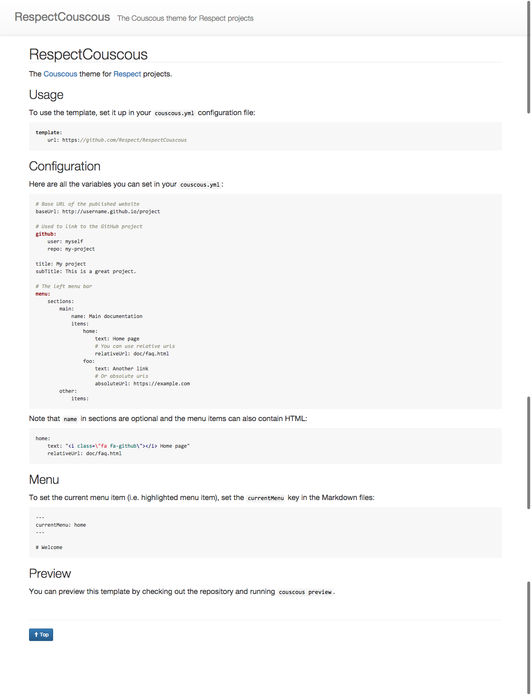

# RespectCouscous

The [Couscous](http://couscous.io) template for [Respect](http://respect.li) projects.

## Screenshot



## Usage

To use the template, set it up in your `couscous.yml` configuration file:

```yaml
template:
    url: https://github.com/Respect/RespectCouscous
```

## Configuration

Here are all the variables you can set in your `couscous.yml`:

```yaml
# Base URL of the published website
baseUrl: http://username.github.io/project

# Used to link to the GitHub project
github:
    user: myself
    repo: my-project

title: My project
subTitle: This is a great project.

gaTrackingId: Google Analytics' Tracking ID

# The left menu bar
menu:
    sections:
        main:
            name: Main documentation
            items:
                home:
                    text: Home page
                    # You can use relative urls
                    relativeUrl: doc/faq.html
                foo:
                    text: Another link
                    # Or absolute urls
                    absoluteUrl: https://example.com
        other:
            items:
```

Note that `name` in sections are optional and the menu items can also contain HTML:

```yaml
home:
    text: "<i class=\"fa fa-github\"></i> Home page"
    relativeUrl: doc/faq.html
```

## Menu

To set the current menu item (i.e. highlighted menu item), set the `currentMenu`
key in the Markdown files:

```markdown
---
currentMenu: home
---

# Welcome
```


## Preview

You can preview this template by checking out the repository and running `couscous preview`.

## License

See [LICENSE](LICENSE.md) file.

This template is based on [Template-Basic](https://github.com/CouscousPHP/Template-Basic)
and uses [Twitter Bootstrap](http://getbootstrap.com) and [highlight.js](https://highlightjs.org).
